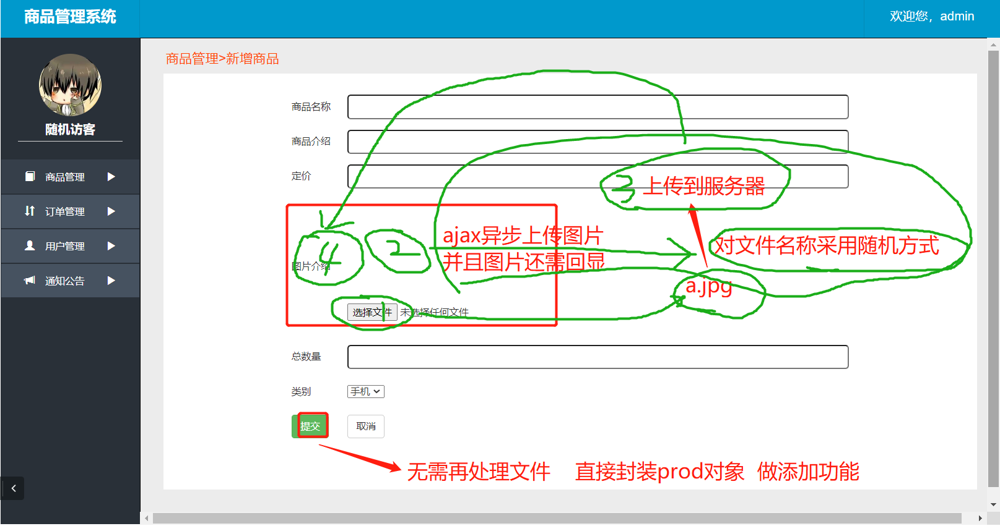

# 数据库

## 用户表创建

```sql
CREATE TABLE admin(
a_id INT AUTO_INCREMENT PRIMARY KEY,
a_name VARCHAR(20),
a_pass VARCHAR(20)
);
INSERT INTO admin(a_id,a_name,a_pass) VALUES(1,'admin','49ba59abbe56e057');//MD5加密后的密码
```

## 商品类型表创建

```sql
CREATE TABLE product_type
(
type_id int auto_increment PRIMARY KEY,
type_name varchar(20)
);

####################添加数据
insert into product_type(type_name) values('手机');
insert into product_type(type_name) values('电脑');
insert into product_type(type_name) values('电视');
```

## 商品信息表创建

```sql
create table product_info
(
p_id int auto_increment primary key,
p_name varchar(20),
p_content varchar(200), ##############33商品规格/简介
p_price int, ###############价格
p_image varchar(200), #############图片
p_number int, ########数量
type_id int,
p_date date,
FOREIGN KEY(type_id) REFERENCES product_type(type_id)
);

####添加数据
INSERT INTO product_info(p_name,p_content,p_price,p_image,p_number,type_id,p_date) VALUES('小米Note2','双曲面 黑色 6GB内存 64GB闪存',2899,'xmNote2.jpg',500,1,'2018-01-04');
INSERT INTO product_info(p_name,p_content,p_price,p_image,p_number,type_id,p_date) VALUES('红米Note5A','5.5英寸 粉色 2GB内存 16GB闪存',699,'hmNote5A.jpg',500,1,'2018-01-05');
INSERT INTO product_info(p_name,p_content,p_price,p_image,p_number,type_id,p_date) VALUES('红米Note4X','5.5英寸 绿色 4GB内存 64GB闪存',1299,'hmNote4X.jpg',500,1,'2018-01-06');
INSERT INTO product_info(p_name,p_content,p_price,p_image,p_number,type_id,p_date) VALUES('红米4','5英寸 金色 3GB内存 32GB闪存',999,'hm4.jpg',500,1,'2018-01-07');
INSERT INTO product_info(p_name,p_content,p_price,p_image,p_number,type_id,p_date) VALUES('红米4X','5英寸 黑色 3GB内存 32GB闪存',899,'hm4X.jpg',500,1,'2018-01-08');

INSERT INTO product_info(p_name,p_content,p_price,p_image,p_number,type_id,p_date) VALUES('小米平板3','7.9英寸 金色 4GB内存 64GB闪存',1499,'xmPad3.jpg',500,2,'2018-01-09');
INSERT INTO product_info(p_name,p_content,p_price,p_image,p_number,type_id,p_date) VALUES('小米Air12','12.5英寸 银色 4GB内存 128GB闪存',3599,'xmAir12.jpg',500,2,'2018-01-18');
INSERT INTO product_info(p_name,p_content,p_price,p_image,p_number,type_id,p_date) VALUES('小米Air13','13.3英寸 银色 8GB内存 256GB闪存',4999,'xmAir13.jpg',500,2,'2018-01-17');
INSERT INTO product_info(p_name,p_content,p_price,p_image,p_number,type_id,p_date) VALUES('小米Pro','15.6英寸 灰色 16GB内存 256GB闪存',6999,'xmPro.jpg',500,2,'2018-01-16');

INSERT INTO product_info(p_name,p_content,p_price,p_image,p_number,type_id,p_date) VALUES('小米电视4','49英寸 原装LG屏 3840×2160 真4K',3299,'xmTV4-49.jpg',500,3,'2018-01-15');
INSERT INTO product_info(p_name,p_content,p_price,p_image,p_number,type_id,p_date) VALUES('小米电视4','55英寸 原装三星屏 3840×2160 真4K',3999,'xmTV4-55.jpg',500,3,'2018-01-13');
INSERT INTO product_info(p_name,p_content,p_price,p_image,p_number,type_id,p_date) VALUES('小米电视4','65英寸 原装三星屏 3840×2160 真4K',8999,'xmTV4-65.jpg',500,3,'2018-01-22');
INSERT INTO product_info(p_name,p_content,p_price,p_image,p_number,type_id,p_date) VALUES('小米电视4A','43英寸 FHD全高清屏 1920*1080',1999,'xmTV4A-43.jpg',500,3,'2018-01-11');
INSERT INTO product_info(p_name,p_content,p_price,p_image,p_number,type_id,p_date) VALUES('小米电视4A','49英寸 FHD全高清屏 1920*1080',2299,'xmTV4A-49.jpg',500,3,'2018-01-21');
INSERT INTO product_info(p_name,p_content,p_price,p_image,p_number,type_id,p_date) VALUES('小米MIX2','全陶瓷 黑色 8GB内存 128GB闪存',4699,'xmMIX2.jpg',500,1,'2018-04-01');
INSERT INTO product_info(p_name,p_content,p_price,p_image,p_number,type_id,p_date) VALUES('小米Note3','全网通 蓝色 6GB内存 64GB闪存',2499,'xmNote3.jpg',500,1,'2018-03-01');
INSERT INTO product_info(p_name,p_content,p_price,p_image,p_number,type_id,p_date) VALUES('小米6','玻璃金属 白色 6GB内存 128GB闪存',2899,'xm6.jpg',500,1,'2018-02-01');
INSERT INTO product_info(p_name,p_content,p_price,p_image,p_number,type_id,p_date) VALUES('小米MAX2','全金属 金色 4GB内存 64GB闪存',1599,'xmMAX2.jpg',500,1,'2018-01-02');
INSERT INTO product_info(p_name,p_content,p_price,p_image,p_number,type_id,p_date) VALUES('小米5X','全金属 金色 4GB内存 64GB闪存',1499,'xm5X.jpg',500,1,'2018-01-03');
```

# 搭建环境

创建一个普通的maven项目  不要依赖骨架

添加web依赖


## 1.创建maven配置web项目

pom.xml导入依赖

```xml
<dependencies>
        <!--Junit-->
        <dependency>
            <groupId>junit</groupId>
            <artifactId>junit</artifactId>
            <version>4.12</version>
        </dependency>
        <!--数据库驱动-->
        <dependency>
            <groupId>mysql</groupId>
            <artifactId>mysql-connector-java</artifactId>
            <version>5.1.47</version>
        </dependency>
        <!-- 数据库连接池 -->
        <dependency>
            <groupId>com.alibaba</groupId>
            <artifactId>druid</artifactId>
            <version>1.0.9</version>
        </dependency>

        <!--Servlet - JSP -->
        <dependency>
            <groupId>javax.servlet</groupId>
            <artifactId>servlet-api</artifactId>
            <version>2.5</version>
        </dependency>
        <dependency>
            <groupId>javax.servlet.jsp</groupId>
            <artifactId>jsp-api</artifactId>
            <version>2.2</version>
        </dependency>
        <dependency>
            <groupId>javax.servlet</groupId>
            <artifactId>jstl</artifactId>
            <version>1.2</version>
        </dependency>

        <!--Mybatis-->
        <dependency>
            <groupId>org.mybatis</groupId>
            <artifactId>mybatis</artifactId>
            <version>3.5.2</version>
        </dependency>
        <dependency>
            <groupId>org.mybatis</groupId>
            <artifactId>mybatis-spring</artifactId>
            <version>2.0.2</version>
        </dependency>
        <dependency>
            <groupId>com.github.pagehelper</groupId>
            <artifactId>pagehelper</artifactId>
            <version>5.2.0</version>
        </dependency>
        <!--Spring-->
        <dependency>
            <groupId>org.springframework</groupId>
            <artifactId>spring-webmvc</artifactId>
            <version>5.1.9.RELEASE</version>
        </dependency>
        <dependency>
            <groupId>org.springframework</groupId>
            <artifactId>spring-jdbc</artifactId>
            <version>5.1.9.RELEASE</version>
        </dependency>
        <dependency>
            <groupId>org.aspectj</groupId>
            <artifactId>aspectjweaver</artifactId>
            <version>1.9.4</version>
        </dependency>

        <dependency>
            <groupId>org.projectlombok</groupId>
            <artifactId>lombok</artifactId>
            <version>1.16.10</version>
        </dependency>
    </dependencies>
    <build>
        <resources>
            <resource>
                <directory>src/main/java</directory>
                <includes>
                    <include>**/*.properties</include>
                    <include>**/*.xml</include>
                </includes>
                <filtering>false</filtering>
            </resource>
            <resource>
                <directory>src/main/resources</directory>
                <includes>
                    <include>**/*.properties</include>
                    <include>**/*.xml</include>
                </includes>
                <filtering>false</filtering>
            </resource>
        </resources>
    </build>
```


导入依赖环境jar、包


添加成功后:


## 2.搭建各个包


### 导入静态资源


### 样式无效解决方案:

导入的外部css文件和js文件无效检查方法:

1.先看web.xml配置文件

```xml
<servlet>
        <servlet-name>DispatcherServlet</servlet-name>
        <servlet-class>org.springframework.web.servlet.DispatcherServlet</servlet-class>
        <init-param>
            <param-name>contextConfigLocation</param-name>
            <!--一定要注意:我们这里加载的是总的配置文件，之前被这里坑了！-->
            <param-value>classpath:applicationContext.xml</param-value>
        </init-param>
        <load-on-startup>1</load-on-startup>
    </servlet>
    <servlet-mapping>
        <servlet-name>DispatcherServlet</servlet-name>
        <url-pattern>/</url-pattern>  <!--一定要注意:/代表的拦截所有 所以css,js,图片等等都会被过滤  所以看spring-mvc文件中有没有设置静态过滤-->
    </servlet-mapping>
```

spring-mvc文件

```xml
 <mvc:default-servlet-handler/>   过滤静态资源
```

2.检查各个jsp文件导入的路径是否有问题 

```html
<link rel="stylesheet" href="${pageContext.request.contextPath}/css/bootstrap.css" />
```

3.自己创建一个css文件引入   看能否生效

发现自己设置的css文件有效   但是引入的css文件依旧没有效果   

浏览器F12检查     


### 编写database.properties文件

```properties
jdbc.driver=com.mysql.jdbc.Driver
jdbc.url=jdbc:mysql://localhost:3306/xiaomi?useUnicode=true&characterEncoding=utf8
jdbc.username=root
jdbc.password=1234
```

### 编写mybatis核心配置文件

```xml
<?xml version="1.0" encoding="UTF-8" ?>
<!DOCTYPE configuration
        PUBLIC "-//mybatis.org//DTD Config 3.0//EN"
        "http://mybatis.org/dtd/mybatis-3-config.dtd">
<configuration>
    <settings>
        <setting name="mapUnderscoreToCamelCase" value="true"/>
    </settings>
    <typeAliases>
        <package name="com.ssm.pojo"/>
    </typeAliases>
    <plugins>
        <!-- 设置分页的插件 -->
        <plugin interceptor="com.github.pagehelper.PageInterceptor"></plugin>
    </plugins>
    <mappers>
        <package name="com.ssm.dao"/>
    </mappers>
</configuration>
```

### 编写spring-dao文件

```xml
<beans xmlns="http://www.springframework.org/schema/beans"
       xmlns:xsi="http://www.w3.org/2001/XMLSchema-instance"
       xmlns:context="http://www.springframework.org/schema/context"
       xsi:schemaLocation="http://www.springframework.org/schema/beans
       http://www.springframework.org/schema/beans/spring-beans.xsd http://www.springframework.org/schema/context https://www.springframework.org/schema/context/spring-context.xsd">

    <!--关联数据库配置文件 -->
    <context:property-placeholder location="classpath:database.properties"/>
    <!--配置数据源   druid数据源-->
    <bean id="dataSource" class="com.alibaba.druid.pool.DruidDataSource">
        <property name="driverClassName" value="${jdbc.driver}"/>
        <property name="url" value="${jdbc.url}"/>
        <property name="username" value="${jdbc.username}"/>
        <property name="password" value="${jdbc.password}"/>
    </bean>
    <!--配置sqlSessionFactory -->
    <bean id="sqlSessionFactory" class="org.mybatis.spring.SqlSessionFactoryBean">
        <property name="dataSource" ref="dataSource"/>
        <property name="configLocation" value="classpath:mybatis-config.xml"/>
    </bean>
    <!--配置dao包的扫描   动态实现Dao接口注入spring-->
    <bean class="org.mybatis.spring.mapper.MapperScannerConfigurer">
        <property name="sqlSessionFactoryBeanName" value="sqlSessionFactory"/>
        <property name="basePackage" value="com.ssm.dao"/>
    </bean>
</beans>
```

### 编写spring-service文件

```xml
<?xml version="1.0" encoding="UTF-8"?>
<beans xmlns="http://www.springframework.org/schema/beans"
       xmlns:xsi="http://www.w3.org/2001/XMLSchema-instance"
       xmlns:context="http://www.springframework.org/schema/context" xmlns:tx="http://www.springframework.org/schema/tx"
       xmlns:aop="http://www.springframework.org/schema/aop"
       xsi:schemaLocation="http://www.springframework.org/schema/beans
       http://www.springframework.org/schema/beans/spring-beans.xsd http://www.springframework.org/schema/context https://www.springframework.org/schema/context/spring-context.xsd http://www.springframework.org/schema/cache http://www.springframework.org/schema/cache/spring-cache.xsd http://www.springframework.org/schema/tx http://www.springframework.org/schema/tx/spring-tx.xsd http://www.springframework.org/schema/aop https://www.springframework.org/schema/aop/spring-aop.xsd">
    <!--扫描service的bean -->
    <context:component-scan base-package="com.ssm.service"/>
    <!-- 注入实现类里面的mapper-->
    <!--<bean id="consumerServiceImpl" class="com.ssm.service.AdminServiceImpl">
        <property name="adminMapper" ref="adminMapper"/>
    </bean>-->
    <!-- 配置事务 -->
    <bean id="transactionManager" class="org.springframework.jdbc.datasource.DataSourceTransactionManager">
        <property name="dataSource" ref="dataSource"/>
    </bean>
    <!--配置事务通知-->
    <tx:advice id="txAdvice" transaction-manager="transactionManager">
        <tx:attributes>
            <!--配置哪些方法使用什么样的事务,配置事务的传播特性-->
            <tx:method name="select" read-only="true"/>
            <tx:method name="*" propagation="REQUIRED"/>
        </tx:attributes>
    </tx:advice>
    <aop:config>
        <aop:pointcut id="txPointcut" expression="execution(* com.ssm.service.*.*(..))"/>
        <aop:advisor advice-ref="txAdvice" pointcut-ref="txPointcut"/>
    </aop:config>
</beans>
```

### 编写spring-mvc文件

```xml
<?xml version="1.0" encoding="UTF-8"?>
<beans xmlns="http://www.springframework.org/schema/beans"
       xmlns:xsi="http://www.w3.org/2001/XMLSchema-instance"
       xmlns:context="http://www.springframework.org/schema/context"
       xmlns:mvc="http://www.springframework.org/schema/mvc"
       xsi:schemaLocation="http://www.springframework.org/schema/beans
   http://www.springframework.org/schema/beans/spring-beans.xsd
   http://www.springframework.org/schema/context
   http://www.springframework.org/schema/context/spring-context.xsd
   http://www.springframework.org/schema/mvc
   https://www.springframework.org/schema/mvc/spring-mvc.xsd">
    <!-- 1.开启SpringMVC注解驱动 -->
    <mvc:annotation-driven />
    <!-- 2.静态资源默认servlet配置-->
    <mvc:default-servlet-handler/>

    <!-- 3.配置jsp 显示ViewResolver视图解析器  可以不配 -->
    <bean class="org.springframework.web.servlet.view.InternalResourceViewResolver">
        <property name="viewClass" value="org.springframework.web.servlet.view.JstlView" />
        <property name="prefix" value="/jsp/" />
        <property name="suffix" value=".jsp" />
    </bean>

    <!-- 4.扫描web相关的bean -->
    <context:component-scan base-package="com.ssm.controller" />
    <!-- 5.处理controller乱码问题 -->
    <mvc:annotation-driven>
        <mvc:message-converters>
            <bean class="org.springframework.http.converter.StringHttpMessageConverter">
                <property name="supportedMediaTypes">
                    <list>
                        <value>text/html;charset=UTF-8</value>
                        <value>application/json;charset=UTF-8</value>
                        <value>*/*;charset=UTF-8</value>
                    </list>
                </property>
            </bean>
        </mvc:message-converters>
    </mvc:annotation-driven>

</beans>
```

编写web.xml

```xml
<?xml version="1.0" encoding="UTF-8"?>
<web-app xmlns="http://xmlns.jcp.org/xml/ns/javaee"
         xmlns:xsi="http://www.w3.org/2001/XMLSchema-instance"
         xsi:schemaLocation="http://xmlns.jcp.org/xml/ns/javaee http://xmlns.jcp.org/xml/ns/javaee/web-app_4_0.xsd"
         version="4.0">
    
    <servlet>
        <servlet-name>DispatcherServlet</servlet-name>
        <servlet-class>org.springframework.web.servlet.DispatcherServlet</servlet-class>
        <init-param>
            <param-name>contextConfigLocation</param-name>
            <!--一定要注意:我们这里加载的是总的配置文件，之前被这里坑了！-->
            <param-value>classpath:applicationContext.xml</param-value>
        </init-param>
        <load-on-startup>1</load-on-startup>
    </servlet>
    <servlet-mapping>
        <servlet-name>DispatcherServlet</servlet-name>
        <url-pattern>/</url-pattern>
    </servlet-mapping>

    <!--encodingFilter-->
    <filter>
        <filter-name>encodingFilter</filter-name>
        <filter-class>
            org.springframework.web.filter.CharacterEncodingFilter
        </filter-class>
        <init-param>
            <param-name>encoding</param-name>
            <param-value>utf-8</param-value>
        </init-param>
    </filter>
    <filter-mapping>
        <filter-name>encodingFilter</filter-name>
        <url-pattern>/*</url-pattern>
    </filter-mapping>
    <welcome-file-list>
        <welcome-file>/jsp/login.jsp</welcome-file>
    </welcome-file-list>
</web-app>
```

### 将三个配置文件整合到一个配置文件中   


### 引入MD5

```java
package com.ssm.utils;

import java.security.MessageDigest;
import java.security.NoSuchAlgorithmException;

public class MD5Utils {
    public static String code(String str) {
        try {
            MessageDigest md = MessageDigest.getInstance("MD5");
            md.update(str.getBytes());
            byte[] byteDigest = md.digest();
            int i;
            StringBuffer buf = new StringBuffer("");
            for (int offset = 0; offset < byteDigest.length; offset++) {
                i = byteDigest[offset];
                if (i < 0)
                    i += 256;
                if (i < 16)
                    buf.append("0");
                buf.append(Integer.toHexString(i));
            }
            //32位加密(小写)
            //return buf.toString();
            //32位加密(大写)
            //return buf.toString().toUpperCase();
            // 16位的加密(小写)
            return buf.toString().substring(8, 24);
            // 16位的加密(大写)
            //return buf.toString().substring(8, 24).toUpperCase();
        } catch (NoSuchAlgorithmException e) {
            e.printStackTrace();
            return null;
        }

    }
}
```

# 3.编写service

```java
package com.ssm.service;

import com.ssm.dao.AdminMapper;
import com.ssm.pojo.Admin;
import com.ssm.utils.MD5Utils;
import org.springframework.stereotype.Service;

import javax.annotation.Resource;

@Service
public class AdminServiceImpl implements AdminService {
    @Resource
    private AdminMapper adminMapper;

    public Admin selectConsumerByNameAndPwd(String aName, String aPass) {
        return adminMapper.selectConsumerByNameAndPwd(aName, MD5Utils.code(aPass));
    }
}

```


# 4.编写controller

```java
package com.ssm.controller;

import com.ssm.pojo.Admin;
import com.ssm.service.AdminService;
import org.springframework.stereotype.Controller;
import org.springframework.ui.Model;
import org.springframework.web.bind.annotation.RequestMapping;
import org.springframework.web.bind.annotation.RequestParam;

import javax.annotation.Resource;

@Controller
@RequestMapping("/admin")
public class AdminController {
    @Resource(name = "adminServiceImpl")
    private AdminService adminService;

    @RequestMapping("/login")
    public String login(Model model, @RequestParam("aName") String aName, @RequestParam("aPass")String aPass){
        Admin admin = adminService.selectConsumerByNameAndPwd(aName, aPass);
        if(admin!=null){
            System.out.println(admin);
            model.addAttribute("admin",admin);
            return "main";
        }else {
            model.addAttribute("errmsg","用户名或密码错误");
            return "login";
        }
    }
}

```

# 商品显示

Mapper:

```xml
//查询所有的商品
    List<ProductInfo> getAllProductInfo(Map<String,Object> maps);   
```

Mapper.xml:

```xml
<select id="getAllProductInfo" resultType="productInfo" parameterType="map">
        select * from product_info   
        <if test="orderBy!=null">//是否降序根据map传入的参数决定
            order by ${orderBy} desc
        </if>
    </select>
```

Service实现类:

```java
//查询所有数据
    public List<ProductInfo> getAllProductInfo(Map<String, Object> maps) {
        return productInfoMapper.getAllProductInfo(maps);
    }
```

Cotroller:

```java
package com.ssm.controller;

import com.ssm.pojo.Admin;
import com.ssm.pojo.ProductInfo;
import com.ssm.service.AdminService;
import com.ssm.service.ProductInfoService;
import org.springframework.stereotype.Controller;
import org.springframework.ui.Model;
import org.springframework.web.bind.annotation.RequestMapping;
import org.springframework.web.bind.annotation.RequestParam;
import org.springframework.web.bind.annotation.ResponseBody;

import javax.annotation.Resource;
import java.util.List;

@Controller
@RequestMapping("/product")
public class ProductInfoController {
    @Resource
    private ProductInfoService productInfoService;
    //登录功能
    @RequestMapping("/selectAll")
    public String selectAll(Model model){
        List<ProductInfo> productInfoList = productInfoService.getAllProductInfo(null);
        //System.out.println(productInfoList);
        model.addAttribute("productInfoList",productInfoList);
        return "product";
    }
}

```

页面:


# 商品分页

去关注PageHelper 和PageInfo两个类  

PageHelper


该方法用来设置当前页码和每页条数 


PageInfo

```java
public static final int DEFAULT_NAVIGATE_PAGES = 8;
    private int pageNum;   //当前的页码
    private int pageSize;   //设置每页显示多少条
    private int size;     //每页真实显示的条数
    private long startRow; 
    private long endRow;
    private int pages;   //总页数
    private int prePage;  //上一页的页码
    private int nextPage;   
    private boolean isFirstPage;
    private boolean isLastPage;
    private boolean hasPreviousPage;
    private boolean hasNextPage;
    private int navigatePages;
    private int[] navigatepageNums;
    private int navigateFirstPage;
    private int navigateLastPage;

    public PageInfo() {
        this.isFirstPage = false;
        this.isLastPage = false;
        this.hasPreviousPage = false;
        this.hasNextPage = false;
    }
	//该构造方法需要传入所有数据的集合   然后它会自动帮我们把所有的数据封装好
	//所有分页需要的数据全部自动封装好   直接拿来使用  前提是先要给PageHelper设置好页码和每页条数
    public PageInfo(List<T> list) {
        this(list, 8);
    }

```

## 先显示第一页的数据

### 1.先做排序  

逆序输出   因为在做完添加功能后 一般数据显示在第一条   

### 2.编写Mapper.xml

```xml
<select id="getAllProductInfo" resultType="productInfo" parameterType="map">
        select * from product_info
        <if test="orderBy!=null">
            order by ${orderBy} desc  
        </if>
    </select>
一定要用${orderBy}去接收    在排序语句中#是无法接收到正常参数的
```

注意:分页并不需要mapper去创建方法   

```java
public interface ProductInfoMapper {
    //查询所有的商品
    List<ProductInfo> getAllProductInfo(Map<String,Object> maps);
}
```


## 3.编写Service 

```java

//按照pid降序查询  并分页
    public List<ProductInfo> getProductInfoByLimit(int pageNum, int pageSize) {
        //给PageHelper设置当前页码和每页的条数
        PageHelper.startPage(pageNum,pageSize);
        //获取数据表中所有的数据   然后把集合丢给pageInfo对象
        Map<String,Object> maps  = new HashMap<String, Object>();
        maps.put("orderBy","p_id");
        //拿到降序的集合
        List<ProductInfo> productInfos = productInfoMapper.getAllProductInfo(maps);
        //直接通过pageInfo拿到对应页码的集合数据
        PageInfo<ProductInfo> info = new PageInfo<ProductInfo>(productInfos);
        return info.getList();
    }
```

## 4.编写控制层代码

分析:发现控制层需要拿到PageInfo对象  才能在页面中显示各种数据

所以重新更改service的接口   将返回集合变成返回PageInfo对象   因为集合也在这个对象中

```java
 public PageInfo<ProductInfo> getProductInfoByLimit(int pageNum, int pageSize) {
        //给PageHelper设置当前页码和每页的条数
        PageHelper.startPage(pageNum,pageSize);
        //获取数据表中所有的数据   然后把集合丢给pageInfo对象
        Map<String,Object> maps  = new HashMap<String, Object>();
        maps.put("orderBy","p_id");
        //拿到降序的集合
        List<ProductInfo> productInfos = productInfoMapper.getAllProductInfo(maps);
        //直接通过pageInfo拿到对应页码的集合数据
        PageInfo<ProductInfo> info = new PageInfo<ProductInfo>(productInfos);
        return info;
    }
```


controller

```java
//其他页面ajax分页查询
    @RequestMapping("/selectLimitByAjax")
    @ResponseBody
    public void selectLimitByAjax(HttpSession session,@RequestParam("pageNum") int pageNum){
        PageInfo<ProductInfo> info = productInfoService.getProductInfoByLimit(pageNum,PAGE_SIZE);
        //拿到info对象  传到页面
        session.setAttribute("info",info);
        
    }
```

页面:


分页中如果到达最后一页，PageInfo的nextPage属性会变成0   

所以为了客户体验度   我们使用js将0变成1再传入给controller

也就是查询第一页数据

```javascript
function ajaxsplit(pageNum) {
        //取出查询条件
        var pname = $("#pname").val();
        var typeid = $("#typeid").val();
        var lprice = $("#lprice").val();
        var hprice = $("#hprice").val();
        //判断pageNum是否等于0   如果等于0代表没有下一页  我们直接显示第一页的数据
        pageNum = pageNum==0?1:pageNum;
        //向服务发出ajax请求,请示page页中的所有数据,在当前页面上局部刷新显示
        $.post("${pageContext.request.contextPath}/product/selectLimitByAjax",{"pageNum": pageNum},function(){
            $("#table").load("http://localhost:8080/ssm_manager/jsp/product.jsp #table");
        });
    }
```

# 添加功能

## 发现多个页面中都存在下拉框  也就是商品类型


了解jstl标签库   和el表达式(自动从各个作用域中去找值  request  session  appliaction)

```jsp
jstl  以前jsp页面上标签和代码脚本互相嵌套
比如 后台传过来集合 types 1手机  2电脑 3电视

现在是修改页面   要修改的对象本来就是电脑    但是现在却显示的是手机  因为数据库第一个就是手机  所以需要给电脑这一项设置selected属性   if(当前的选项的value值==对象的value值){给当前选项加上一个selected=“selected”}


<select>
   	<% 
    	for(int i=0;i<=types.size();i++){
     %>    
    		<option <%if(对象.id==types[i].id)%>   value="<%=types[i].id%>"><%=types[i].name%></option>	
    <%  
        }
    %>
</select>
因为存在逻辑判断  所以页面中大量的互相嵌套  页面非常乱  所以有了jstl标签库  比如  <c:foreach></c:foreach> 和<c:if></c:if>

所以改造后的代码就是:

<c:foreach item={types} var = "type">
    <option
            <c:if test="${type.id==对象.id}">selected=“selected”</c:if>  
					value="${type.id}">${type.value}
	</option>
</c:foreach>


```


如果每个页面都去加载访问数据库  效率不高

所以我们将商品类型这个数据提前加载   当tomcat运行起来的时候  这个商品类型数据就已经被我加载好了  所有页面中都可以访问这个 数据   将typeList放入到容器中  方便各个页面调用

我们在这里选择使用servlet的监听器： servlet的监听器相当于是tomcat容器中的  而spring监听器跟tomcat没关系  并且是比容器后加载的

### 实现步骤

创建一个类  继承Servlet监听器   然后重写方法即可

```java
package com.ssm.listener;

import com.ssm.pojo.ProductType;
import com.ssm.service.ProductTypeService;
import org.springframework.context.ApplicationContext;
import org.springframework.context.support.ClassPathXmlApplicationContext;

import javax.servlet.ServletContextEvent;
import javax.servlet.ServletContextListener;
import java.util.List;

@WebListener  //添加该注解必须添加依赖    tomcat-servlet-api
public class ProductTypeLisener implements ServletContextListener {
    public void contextInitialized(ServletContextEvent servletContextEvent) {
        //加载配置文件   调用serivce的方法  查询到所有的商品类型  然后放到application作用域中
        ApplicationContext context =  new ClassPathXmlApplicationContext("applicationContext.xml");
        ProductTypeService service = context.getBean("productTypeServiceImpl", ProductTypeService.class);
        List<ProductType> typeList =  service.getAllType();
        servletContextEvent.getServletContext().setAttribute("typeList",typeList);
        //容器只要已加载  那么新增，修改，查询页面所有用到typeList下拉框的位置都有数据了
    }

    public void contextDestroyed(ServletContextEvent servletContextEvent) {

    }
}

```

## 图片上传回显



### 导入文件上传的依赖

```xml
		<dependency>
            <groupId>commons-fileupload</groupId>
            <artifactId>commons-fileupload</artifactId>
            <version>1.3.3</version>
        </dependency>
        <!--servlet-api导入高版本的-->
        <dependency>
            <groupId>javax.servlet</groupId>
            <artifactId>javax.servlet-api</artifactId>
            <version>4.0.1</version>
        </dependency>
```

删掉之前的低版本的servlet依赖   重新导入lib文件夹！！！


### 配置spring上传组件

```xml
<!--文件上传配置-->
<bean id="multipartResolver"  class="org.springframework.web.multipart.commons.CommonsMultipartResolver">
    <!-- 请求的编码格式，必须和jSP的pageEncoding属性一致，以便正确读取表单的内容，默认为ISO-8859-1 -->
    <property name="defaultEncoding" value="utf-8"/>
    <!-- 上传文件大小上限，单位为字节（104857600=100M） -->
    <property name="maxUploadSize" value="104857600"/>
    <property name="maxInMemorySize" value="40960"/>
</bean>
```

### 编写controller类

```java
@RequestMapping("/ajaxImg")
    @ResponseBody
    public String ajaxImg(MultipartFile pimage, HttpServletRequest request){
        //将文件名称随机  uuid 生成一个32位随机码  去掉-
        String uuid = UUID.randomUUID().toString().replace("-","");
        //获取上传的文件 的后缀名   .jpg  .png
        String oldName = pimage.getOriginalFilename();
        //比如aaa.jpg  找到.的角标
        String houzhui = oldName.substring(oldName.lastIndexOf("."));
        String fileName = uuid+houzhui;
        //上传到服务器
        String path  = request.getServletContext().getRealPath("/image_big");
        System.out.println(path);
        System.out.println(fileName);
        try {
            //完成文件上传
            pimage.transferTo(new File(path+"\\"+fileName));
        } catch (IOException e) {
            e.printStackTrace();
        }
        //返回一个文件名称  方便页面进行回显  (src='')
        return fileName;
    }
```


### 页面的处理(拿到上传后的文件名称)

```javascript
function fileChange(){
			//发送ajax文件上传    ajaxImg  拿到上传后的名称
			$.ajaxFileUpload({
				url:"${pageContext.request.contextPath}/product/ajaxImg",
				fileElementId: "pimage",  //指定文件域的id
				dataType:"text",
				success:function(fileName){
					$("#imgDiv").html("");
					$("#imgDiv").append("");
				}
			});
        }
```

实现controller的添加功能:

```java
@RequestMapping("/save")
    public String save(ProductInfo productInfo,HttpServletRequest request){
        //图片名称   一种是前端传过来  第二种就是直接从当前类中拿出来
        productInfo.setPImage(fileName);
        //日期  是当前的日期
        productInfo.setPDate(new Date());
        //完成添加动作
        int num = productInfoService.addProduct(productInfo);
        if(num>0){
            request.setAttribute("msg","恭喜你！添加成功了！");
            return "forward:/product/selectProByLimit";
        }else{
            request.setAttribute("msg","很遗憾！添加失败！");
            return "";
        }
    }

/*
将图片上传功能里面声明的fileName  拿出来变成成员变量   方便添加对象的时候能够获取到之前上传的文件名
*/
```

# 删除功能

页面;

```javascript
function del(pid) {
        //弹框提示
        if (confirm("您确定删除吗?")) {
            //首先访问contoller完成删除动作并且返回"删除成功"字符串  给弹框功能
            $.post("${pageContext.request.contextPath}/product/deleteById",{"pId":pid},function(result){
                alert(result);
                //然后再次发送请求去查询第一页的数据  更新info对象 
                $.post("${pageContext.request.contextPath}/product/selectProByLimit",{},function(){ 
				//对当前页面内的table进行数据刷新                    	
                    $("#table").load("http://localhost:8080${pageContext.request.contextPath}/jsp/product.jsp #table");
                });
            },"text");
        }
    }


```

controller:

```java
@RequestMapping(value = "/deleteById",produces = "text/html;charset=utf-8")
    @ResponseBody
    public String deleteById(int pId,HttpServletRequest request){
        int num =  productInfoService.deleteById(pId);
        if(num>0){
            //返回提示信息
            return "恭喜你!删除成功！！！";
        }
        return "失败！";
    }
//注意编码问题
```


# 修改功能

思路:


编写根据id查询对象的方法   然后跳转到修改页面

```java
@RequestMapping("selectById")
    public String selectById(int pId,HttpServletRequest request){
        ProductInfo productInfo = productInfoService.getById(pId);
        request.setAttribute("prod",productInfo);
        return "forward:/jsp/update.jsp";
    }
```

修改页面:

保留两个隐藏于   存储id和图片的原名称

```html
<input type="hidden" value="${prod.PId}" name="pId">
<input type="hidden" value="${prod.PImage}" name="pImage">
```

控制层我们去做判断:

如果fileName!=""  代表我修改的时候上传过图片

如果=“”  代表我修改的时候没有改图片   那么直接使用上面的隐藏域   name="pImage"  自动封装  不用处理

```java
@RequestMapping("/update")
    public String update(ProductInfo productInfo,HttpSession session){
        if(!fileName.equals("")){
            productInfo.setPImage(fileName);
        }
        int num = productInfoService.update(productInfo);
        if(num>0){
            session.setAttribute("msg","恭喜你！修改成功了！");
            return "redirect:/product/selectProByLimit";  //增删改通常都是使用重定向
        }else{
            session.setAttribute("msg","很遗憾！修改失败！");
            return "";
        }
    }
```

存在一个小bug:   先添加对象   那么此时fileName也不为空   做修改的时候判断就会出问题  误认为我们修改了图片地址

所以在添加功能里面一定要对fileName这个全局变量进行清空处理

```java

@RequestMapping("/save")
    public String save(ProductInfo productInfo,HttpServletRequest request){
        //图片名称   一种是前端传过来  第二种就是直接从当前类中拿出来
        productInfo.setPImage(fileName);
        //将fileName设置成空  方便修改功能做判断
        fileName="";
        //日期  是当前的日期
        productInfo.setPDate(new Date());
        //完成添加动作
        int num = productInfoService.addProduct(productInfo);
        if(num>0){
            request.setAttribute("msg","恭喜你！添加成功了！");
            return "forward:/product/selectProByLimit";
        }else{
            request.setAttribute("msg","很遗憾！添加失败！");
            return "";
        }
    }
```

全选按钮

```javascript
 //全选复选框功能实现
    function allClick() {
        //获得当前点击后全选按钮的状态
        var flag = $("#all").is(":checked");  //prop方法也可以
        //遍历所有的ck  让他们的状态和flag保持一致
        $("[name=ck]").each(function(){
            $(this).attr("checked",flag);
        });
    }

    //单个复选框点击改变全选复选框功能实现
    function ckClick() {
        //得到下面五个复选框的个数
        var fiveLength = $("input[name='ck']").length;
        //得到下面五个复选框被选中的个数
        var checkedLength = $("input[name='ck']:checked").length;
        //进行对比,改变全选复选框的状态
        if(fiveLength == checkedLength){
            $("#all").prop("checked",true);
        }else{
            $("#all").prop("checked",false);
        }
    }
```


# 批量删除

思路:页面获取所有选中的ck对象   然后拼接成id,id,id,这种字符串    传给controller

controller将这个字符串做处理  变成集合   传递给map  成功后给提示

页面这边再次发送请求刷新第一页数据即可

```javascript
//批量删除
    function deleteBatch() {
        //得到所有选中复选框的对象,根据其长度判断是否有选中商品
        var cks = $("input[name='ck']:checked");  
        //如果有选中的商品
        if(cks.length == 0){
            alert("请先选择将要删除的商品!");
        }else{
            var str = "";
            var pid = "";
            if(confirm("您确定要删除"+cks.length+"条商品吗?")){
               // alert("可以进行删除!");
                //获取其value的值,进行字符串拼接
                $.each(cks,function () {
                    pid = $(this).val();
                    str += pid+",";  //145   ===>1,4,5,
                });

                //发送ajax请求,进行批量删除的提交
                $.post("${pageContext.request.contextPath}/product/deleteBatch",{"pids":str},function(result){
                        alert(result);
                        //重新刷新页面
                    $.post("${pageContext.request.contextPath}/product/selectProByLimit",{},function(){
                        $("#table").load("http://localhost:8080${pageContext.request.contextPath}/jsp/product.jsp #table");
                    });
                },"text");

            }
        }
    }
```

controller层:

```java
@RequestMapping(value = "/deleteBatch",produces = "text/html;charset=utf-8")
    @ResponseBody
    public String deleteBatch(@RequestParam("pids") String pids){
            //pids = 1,2,5,  变成数组   然后通过Arrays工具类变成集合
        List<String> ids =  Arrays.asList(pids.split(","));
        Map<String,Object> maps = new HashMap<String, Object>();
        maps.put("ids",ids);
        int num =  productInfoService.deleteBatch(maps);
        if(num>0){
            return "批量删除成功";
        }
        return "批量删除失败";
    }
```

mapper.xml

```xml
<!--int deleteBatch(Map<String,Object> maps);-->
    <delete id="deleteBatch" parameterType="map">
        delete from product_info where p_id in
        <foreach collection="ids" open="(" close=")" separator="," item="pid">
            #{pid}
        </foreach>
    </delete>
```

# 功能优化

## 删除后依旧停留在当前页面

在处理这两个功能的时候，需要传递一个当前页面的参数   方便显示的时候能够直接获取当前页面对应的info.list

```javascript
//单个删除
    function del(pid,page) {
        //弹框提示
        if (confirm("您确定删除吗?")) {
            $.post("${pageContext.request.contextPath}/product/deleteById",{"pId":pid},function(result){
                alert(result);
                //当前页码是在获取当前页面数据的时候才需要传入
                $.post("${pageContext.request.contextPath}/product/selectProByLimit",{"page":page},function(){
                    $("#table").load("http://localhost:8080${pageContext.request.contextPath}/jsp/product.jsp #table");
                });
            },"text");
```

传入page后   在controller的selectProByLimit方法中一定要记得加上page参数接收

首页点击商品管理的链接上也要加上page参数

```html
<a href="${pageContext.request.contextPath}/product/selectProByLimit?page=1" target="myright" >
								<li class="two"><span class="glyphicon glyphicon-book" style="color: white;"></span>&nbsp;&nbsp;&nbsp;&nbsp;商品管理&nbsp;&nbsp;&nbsp;&nbsp;&nbsp;&nbsp;&nbsp;&nbsp;<span class="glyphicon glyphicon-play" style="color: white;"></span> </li>
							</a>
```

controller层的save添加方法也要加page

```java
 @RequestMapping("/save")
    public String save(ProductInfo productInfo,HttpServletRequest request){
        //图片名称   一种是前端传过来  第二种就是直接从当前类中拿出来
        productInfo.setPImage(fileName);
        //将fileName设置成空  方便修改功能做判断
        fileName="";
        //日期  是当前的日期
        productInfo.setPDate(new Date());
        //完成添加动作
        int num = productInfoService.addProduct(productInfo);
        if(num>0){
            request.setAttribute("msg","恭喜你！添加成功了！");
            return "forward:/product/selectProByLimit?page=1";
        }else{
            request.setAttribute("msg","很遗憾！添加失败！");
            return "";
        }
    }
```

批量删除的js中也需要加入page

```javascript
//发送ajax请求,进行批量删除的提交
                $.post("${pageContext.request.contextPath}/product/deleteBatch",{"pids":str},function(result){
                        alert(result);
                        //重新刷新页面
                    $.post("${pageContext.request.contextPath}/product/selectProByLimit",{"page":page},function(){
                        $("#table").load("http://localhost:8080${pageContext.request.contextPath}/jsp/product.jsp #table");
                    });
                },"text");
```


## 修改功能优化

点击编辑按钮  传入page   跳到selectById的controller

```javascript
function one(pid,page) {
        //向服务器提交请求,传递商品id
        location.href = "${pageContext.request.contextPath}/product/selectById?pId="+pid+"&page="+page;
    }
```

根据id查询到对象后  在request中放入page   转发跳到update.jsp页面   在update页面上能够获取page的

```java
@RequestMapping("/selectById")
    public String selectById(int pId,HttpServletRequest request,int page){
        ProductInfo productInfo = productInfoService.getById(pId);
        request.setAttribute("prod",productInfo);
        request.setAttribute("page",page);
        return "forward:/jsp/update.jsp";
    }
```

真正做修改的时候    form表单的action地址跳转到controller里面的update方法  在action的地址上面继续传入page

```html
<form action="${pageContext.request.contextPath}/product/update?page=${page}" enctype="multipart/form-data" method="post" id="myform">
```

在controller的update结束后   我们跳转到selectProByLimit进行数据刷新时  传入page

```java
@RequestMapping("/update")
    public String update(ProductInfo productInfo,int page,HttpSession session){
        if(!fileName.equals("")){
            productInfo.setPImage(fileName);
        }
        int num = productInfoService.update(productInfo);
        if(num>0){
            session.setAttribute("msg","恭喜你！修改成功了！");
            return "redirect:/product/selectProByLimit?page="+page;
        }else{
            session.setAttribute("msg","很遗憾！修改失败！");
            return "";
        }
    }
```


# 多条件查询


### 1.完成多条件查询的dao层编写 

分析:在页面跳转中，多次会使用到4个条件，dao层和service层每次传递使用4个参数比较麻烦，所以通常我们会创建一个实体的VO类

专门用来封装数据   然后dao层就只需要传入一个vo对象即可  获得所有的条件参数值

#### 创建vo类：

```java
@Data
@AllArgsConstructor
@NoArgsConstructor
public class ProductVo {
    //vo的属性类型通常都会使用包装类型  因为这些数据都是从页面上传递过来的   避免不填值出现的一些问题  ""变成0 比较麻烦
    private String pname;
    private Integer typeid;
    private Integer lprice;
    private Integer hprice;

}
```

#### 编写mapper:

```java
//模糊查询
List<ProductInfo> getAllProductMoHu(ProductVo vo);   //vo封装所有的条件
```

#### 编写xml文件

```xml
<select id="getAllProductMoHu" parameterType="productVo" resultType="productInfo">
        select * from product_info
        <where>
            <if test="pname!=null and pname!=''">
                and p_name like "%"#{pname}"%"
            </if>
            <if test="typeid!=-1 and typeid!=null">
                and type_id =#{typeid}
            </if>
            <if test="lprice!=null">
                and p_price &gt; #{lprice}
            </if>
            <if test="hprice!=null">
                and p_price &lt; #{hprice}
            </if>
        </where>
        order by p_id desc
    </select>
```

#### 测试查询效果

```java
ApplicationContext context = new ClassPathXmlApplicationContext("applicationContext.xml");
ProductInfoService service = context.getBean("productInfoServiceImpl",ProductInfoService.class);
ProductVo vo = new ProductVo();
vo.setPname("红");
vo.setTypeid(1);
vo.setLprice(800);
vo.setHprice(1000);
List<ProductInfo> infos  =  service.getAllMoHu(vo);
for (ProductInfo info : infos) {
    System.out.println(info);
}
```


#### 在service中创建模糊并且能分页的方法

```java
//模糊查询  返回pageInfo对象   分页
PageInfo<ProductInfo> ajaxSplitpaging(int page,int pageSize, ProductVo vo);
```

#### service的实现类

```java
public PageInfo<ProductInfo> ajaxSplitpaging(int page, int pageSize, ProductVo vo) {
    //给PageHelper设置当前页码和每页的条数
    PageHelper.startPage(page,pageSize);
    //获取数据表中所有的数据   然后把集合丢给pageInfo对象
    //拿到对应条件的集合
    List<ProductInfo> productInfos = productInfoMapper.getAllProductMoHu(vo);
    //直接通过pageInfo拿到对应页码的集合数据
    PageInfo<ProductInfo> info = new PageInfo<ProductInfo>(productInfos);
    return info;
}
```

#### 控制层:

```java
@RequestMapping("/ajaxSplitpaging")
public String ajaxSplitpaging(HttpSession session, ProductVo vo,int page){
    PageInfo<ProductInfo> info = productInfoService.ajaxSplitpaging(page,PAGE_SIZE,vo);
    session.setAttribute("info",info);
    return "product";
}
```

#### 页面

```javascript
function condition() {
    //取出查询条件
    var pname = $("#pname").val();
    var typeid = $("#typeid").val();
    var lprice = $("#lprice").val();
    var hprice = $("#hprice").val();
    $.ajax({
        type:"post",
        url:"${pageContext.request.contextPath}/product/ajaxSplitpaging",
        data:{"pname":pname,"typeid":typeid,"lprice":lprice,"hprice":hprice,"page":1},
        success:function () {
            //刷新显示数据的容器
            $("#table").load("http://localhost:8080/ssm_manager/jsp/product.jsp #table");
        }
    });
}   //注意    点击查询按钮  永远都是查询第一页的数据
```


### 修改所有的请求

#### 1.点击1234页码的时候跳转问题

```javascript
function ajaxsplit(page) {
    //取出查询条件
    var pname = $("#pname").val();
    var typeid = $("#typeid").val();
    var lprice = $("#lprice").val();
    var hprice = $("#hprice").val();
    //判断pageNum是否等于0   如果等于0代表没有下一页  我们直接显示第一页的数据
    page = page==0?1:page;
    //向服务发出ajax请求,请示page页中的所有数据,在当前页面上局部刷新显示
    $.post("${pageContext.request.contextPath}/product/ajaxSplitpaging",{"pname":pname,"typeid":typeid,"lprice":lprice,"hprice":hprice,"page":page},function(){
        $("#table").load("http://localhost:8080/ssm_manager/jsp/product.jsp #table");
    });
}
```

需要带上所有的查询条件


#### 2.单个删除最后一页的最后一条数据时跳转到前一页

controller

```java
@RequestMapping("/ajaxSplitpaging")
public String ajaxSplitpaging(HttpSession session, ProductVo vo,int page){
    PageInfo<ProductInfo> info = productInfoService.ajaxSplitpaging(page,PAGE_SIZE,vo);
    if(info.getList().size()==0 && page>1){
        page--;
        //根据页码重新给info赋值
        info = productInfoService.ajaxSplitpaging(page,PAGE_SIZE,vo);
    }
    session.setAttribute("info",info);
    return "product";
}
```

页面

```javascript
function del(pid,page) {
    //取出查询条件
    var pname = $("#pname").val();
    var typeid = $("#typeid").val();
    var lprice = $("#lprice").val();
    var hprice = $("#hprice").val();
    //弹框提示
    if (confirm("您确定删除吗?")) {
        $.post("${pageContext.request.contextPath}/product/deleteById",{"pId":pid},function(result){
            alert(result);
            //当前页码是在获取当前页面数据的时候才需要传入
            $.post("${pageContext.request.contextPath}/product/ajaxSplitpaging",
                {"pname":pname,"typeid":typeid,"lprice":lprice,"hprice":hprice,"page":page},
                function(){
                    $("#table").load("http://localhost:8080${pageContext.request.contextPath}/jsp/product.jsp #table");
                });
        },"text");
    }
}
```

#### 3.批量删除仍然保留当前页面

直接改页面就可以

```javascript
function deleteBatch(page) {
    //得到所有选中复选框的对象,根据其长度判断是否有选中商品
    var cks = $("input[name='ck']:checked");  //1,4,5
    //如果有选中的商品
    if(cks.length == 0){
        alert("请先选择将要删除的商品!");
    }else{
        var str = "";
        var pid = "";
        if(confirm("您确定要删除"+cks.length+"条商品吗?")){
           // alert("可以进行删除!");
            //获取其value的值,进行字符串拼接
            $.each(cks,function () {
                pid = $(this).val();
                str += pid+",";  //145   ===>1,4,5,
            });
            //取出查询条件
            var pname = $("#pname").val();
            var typeid = $("#typeid").val();
            var lprice = $("#lprice").val();
            var hprice = $("#hprice").val();
            //发送ajax请求,进行批量删除的提交
            $.post("${pageContext.request.contextPath}/product/deleteBatch",{"pids":str},function(result){
                    alert(result);
                    //重新刷新页面
                $.post("${pageContext.request.contextPath}/product/ajaxSplitpaging",{"pname":pname,"typeid":typeid,"lprice":lprice,"hprice":hprice,"page":page},function(){
                    $("#table").load("http://localhost:8080${pageContext.request.contextPath}/jsp/product.jsp #table");
                });
            },"text");

        }
    }
}
```

#### 修改完成后

点击修改按钮先要根据id去查询  

```javascript
function one(pid,page) {
    //向服务器提交请求,传递商品id
    var pname = $("#pname").val();
    var typeid = $("#typeid").val();
    var lprice = $("#lprice").val();
    var hprice = $("#hprice").val();
    var url  = "?pId="+pid+"&page="+page+"&pname="+pname+"&typeid="+typeid+"&lprice="+lprice+"&hprice="+hprice;
    location.href = "${pageContext.request.contextPath}/product/selectById"+url;
}
```

controller的根据id查询控制器

```java
private static ProductVo vo = null;  
@RequestMapping("/selectById")
public String selectById(int pId,HttpServletRequest request,int page,ProductVo vo){
    ProductInfo productInfo = productInfoService.getById(pId);
    request.setAttribute("prod",productInfo);
    request.setAttribute("page",page);
    //将页面传过来的vo赋值给当前类的vo
    this.vo = vo;
    System.out.println("更新前:"+this.vo);
    return "forward:/jsp/update.jsp";
}
```

在这里我们声明了一个全局变量vo用来存储在更新前我们传入的多个条件   免得还需要把vo传到update.jsp 

update.jsp提交更新按钮后又要传回来给controller的update方法  update方法最终是跳转到ajaxSplitpaging 又要传 

所以很麻烦    


更新cotroller的ajaxSplitpaging 方法

```java
 @RequestMapping("/ajaxSplitpaging")
    public String ajaxSplitpaging(HttpSession session, ProductVo vo,int page){
        if(vo.getPname()==null&&vo.getHprice()==null&vo.getLprice()==null&vo.getTypeid()==null){
            vo = this.vo;
        }
        System.out.println("vo"+vo);
        PageInfo<ProductInfo> info = productInfoService.ajaxSplitpaging(page,PAGE_SIZE,vo);
        if(info.getList().size()==0 && page>1){
            page--;
            info = productInfoService.ajaxSplitpaging(page,PAGE_SIZE,vo);
        }
        session.setAttribute("info",info);
        //查询显示完毕后要清空一下this.vo
        //this.vo =null;
        return "product";
    }
```


有个小bug    修改完成后  再来点击1234发现由于条件框里的数据都清空了  导致查询结果有问题

无论是做什么功能，只要跳转到首页  我们就将vo传递给页面进行条件展示


页面


